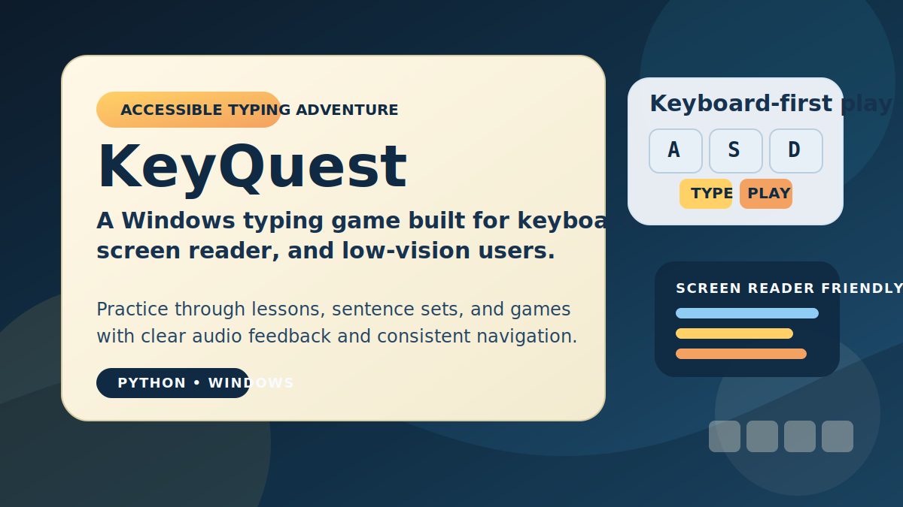

# KeyQuest

[](https://github.com/WebFriendlyHelp/KeyQuest/releases/latest)
[](https://github.com/WebFriendlyHelp/KeyQuest/actions/workflows/ci.yml)



KeyQuest is a typing adventure game for Windows with built-in support for keyboard, screen reader, and low-vision users.

It is aimed at learners who want clearer spoken feedback, keyboard-first navigation, and documentation they can read in a browser or from the app itself.

Download the latest installer or portable ZIP from the [Releases page](https://github.com/WebFriendlyHelp/KeyQuest/releases). Official KeyQuest builds are published there.

If you want the full plain-language user guide, open the [project website](https://webfriendlyhelp.github.io/KeyQuest/) or [README.html](README.html).

## Why KeyQuest

- Accessible-first design for screen reader, keyboard-only, and low-vision users
- Typing practice built around game structure instead of drills alone
- Windows releases available as both installer and portable ZIP
- Expandable game and sentence content stored in plain project folders

## Start Here

- New users: download the latest release from the [Releases page](https://github.com/WebFriendlyHelp/KeyQuest/releases)
- User guide: open the [project website](https://webfriendlyhelp.github.io/KeyQuest/) or [README.html](README.html)
- What's new: read [docs/user/WHATS_NEW.md](docs/user/WHATS_NEW.md)
- Contributors: jump to [For Contributors](#for-contributors)

**Quick start** (requires Python 3.9):

```
pip install -r requirements.txt
py -3.9 keyquest.pyw
```

## For Users

Start with the [project website](https://webfriendlyhelp.github.io/KeyQuest/) or open [README.html](README.html) in a web browser for the full plain-language guide.

- Best for: learners who want typing practice with stronger screen reader, keyboard, and low-vision support
- Downloads: installer and portable ZIP are on the [Releases page](https://github.com/WebFriendlyHelp/KeyQuest/releases)
- Official builds: the GitHub Releases page is the official download source for KeyQuest
- Updates: recent user-facing changes are tracked in [WHATS_NEW.md](docs/user/WHATS_NEW.md)

## For Contributors

Developer notes and session context live under [docs/dev](docs/dev).

- Start with [SESSION_START_GUIDE.md](docs/dev/SESSION_START_GUIDE.md)
- AI-assisted development expectations are documented in [AI_CODE_GENERATION_POLICY.md](AI_CODE_GENERATION_POLICY.md)
- Current project context is in [HANDOFF.md](docs/dev/HANDOFF.md)
- Detailed project history is in [CHANGELOG.md](docs/dev/CHANGELOG.md)
- Desktop accessibility direction is in [DESKTOP_ACCESSIBILITY_RESEARCH.md](docs/dev/DESKTOP_ACCESSIBILITY_RESEARCH.md)
- Manual screen reader checks are in [SCREEN_READER_SMOKE_TESTS.md](docs/dev/SCREEN_READER_SMOKE_TESTS.md)
- Release and workflow details are documented in [docs/dev/RELEASE_POLICY.md](docs/dev/RELEASE_POLICY.md)
- Treat the repo as Python 3.9 everywhere unless an explicit migration changes that policy

## Community

- Use [GitHub Issues](https://github.com/WebFriendlyHelp/KeyQuest/issues) for bugs and actionable feature requests.
- Use GitHub Discussions for questions, accessibility feedback, gameplay ideas, and general project conversation.
- Contributors do not need issue assignment before opening a PR.
- If you want to take an issue, leave a comment first and open a draft PR early for larger changes.
- Small drive-by fixes, especially docs and tests, are welcome without waiting for maintainer approval.

## Contact

- Website: webfriendlyhelp.com
- Feedback: help@webfriendlyhelp.com
